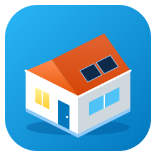

# 3D-Hausplan für Home Assistant (Sidebar-Panel)

Version 1.18.0 · eine einzige Datei, keine weiteren Abhängigkeiten (three.js ist eingebaut, läuft offline).

## Installation über HACS

1. HACS → oben rechts ⋮ → **Benutzerdefinierte Repositories**.
2. Adresse dieses Repositories eintragen, Typ **Integration**, hinzufügen.
3. „3D Haus (Floorplan 3D)“ in HACS suchen, **Herunterladen**, danach Home Assistant neu starten.
4. Einstellungen → Geräte & Dienste → **Integration hinzufügen** → „3D Haus“. Fertig – der Eintrag erscheint in der Seitenleiste.

Kein Eintrag in der `configuration.yaml` nötig.

## Update

HACS zeigt neue Versionen an. **Aktualisieren** und Home Assistant neu starten. Der Plan liegt getrennt in Home Assistant und bleibt erhalten; beim ersten Start einer neuen Version wird er automatisch gesichert (Menü ⋮ → „Sicherung wiederherstellen“).

## Erster Start

Beim ersten Öffnen erscheint der Dialog **„Etagen und Räume aus Home Assistant übernehmen“**. Jeder HA-Bereich wird als Raum auf seiner HA-Etage angelegt und mit dem Bereich verknüpft. Danach einen Grundriss hochladen oder die Räume von Hand anpassen.

## Navigation: Haus → Etage → Raum

Beim Öffnen steht das ganze Haus da. Links oben wählen Sie eine Etage (z. B. Keller); die Kamera fährt hinein, die Etagen darüber und das Dach werden durchsichtig und verschwinden. Darunter erscheinen die Räume der Etage mit Temperatur, Anzahl eingeschalteter Lichter und offener Fenster. Ein Klick auf einen Raum zoomt weiter hinein, blendet die Nachbarräume aus und öffnet das Steuermenü. Zurück geht es mit dem Pfeil oder `Esc`. Dasselbe funktioniert per Klick direkt im 3D-Bild.

Geräte mit zugeordneter Entität tragen ein rundes Symbol (Fenster, Rollladen, Licht, Heizung, Steckdose, Kamera …). Farbig = aktiv (Fenster offen, Licht an, heizt, lädt). Das Symbol ist anklickbar. Abschaltbar unter Einstellungen → „Symbole an Geräten“.

## Dach, Gauben, PV, Treppen

- **Dach frei formen:** Dach anklicken (Bearbeiten). Orange Punkte = Ecken ziehen, helle Punkte ziehen = neue Ecke einfügen, Rechtsklick auf eine Ecke löscht sie. „Form zurücksetzen“ stellt das Rechteck wieder her.
- **Dachgaube:** aus „Bauteile“ auf die Dachfläche ziehen; sie richtet sich nach der Dachneigung aus. Schlepp-, Satteldach- oder Flachdachgaube, mit Fensterkontakt und Rollladen.
- **PV-Modulfeld:** frei auf jede Dachfläche ziehen, Reihen/Spalten einstellen und im Raster einzelne Module herausnehmen (z. B. um Gaube oder Schornstein herum). Mehrere Felder pro Dach sind möglich.
- **Treppen über mehrere Etagen:** „Führt über … Etagen“ einstellen; die Höhe folgt automatisch den Etagenhöhen. Liegt die Treppe vollständig in einem Raum der oberen Etage, wird dort die Deckenöffnung ausgeschnitten.

## Grundstück: Terrasse, Rasen, Einfahrt, Zaun, Hecke

Im Katalog (Bearbeiten) ganz oben unter **„Grundstück: Flächen, Zäune, Hecken“**:

- **Flächen:** Terrasse (Holz oder Platten), Rasen, Einfahrt (Pflaster oder Asphalt), Weg (Kies), Beet, Teich/Pool. Typ anklicken, Fläche im Plan aufziehen; Ecken danach frei verschiebbar. Jede Fläche lässt sich einem HA-Bereich zuweisen (z. B. „Garten“) und ist dann wie ein Raum anklickbar. Belag und Farbe sind am Objekt änderbar.
- **Zäune und Hecken:** Zaun (Latten), Zaun (Stabmatte), Sichtschutz (Holz), Hecke, Mauer. Typ anklicken und Abschnitt für Abschnitt ziehen – die Enden rasten aneinander ein, `Esc` beendet. Höhe, Stärke und Farbe je Abschnitt einstellbar.
- **Überdachungen** (Kategorie „Garten & Außenanlage“): Terrassenüberdachung, Carport, Pavillon. Dachform Flach-, Pult-, Sattel- oder Walmdach; Eindeckung Glas, Ziegel, Blech, Polycarbonat, Holz oder Bitumen; mit oder ohne Wandanschluss; Gestell aus Metall oder Holz. Pfosten, Pfetten und Sparren passen sich Dachform und Neigung automatisch an. Ziegel und Stehfalzblech sind als Muster sichtbar (auch am Hausdach, dort unter „Eindeckung“). Die Dachkante lässt sich wie beim Hausdach über Eckpunkte frei formen. Hausdach und Überdachungen haben Regenrinnen mit Fallrohr an den Traufkanten. Jede Dachkante lässt sich einzeln schalten – auch schräge: im Dachmenü unter „Regenrinnen je Dachkante“ oder per Klick auf den hellen Punkt in der Kantenmitte. Wird die Dachkante schräg gezogen, enden Pfetten, Sparren und Pfosten des Gestells an der neuen Kante. Rechtsklick auf eine Ecke (Dach oder Raum) löscht sie; beim Polygon-Zeichnen nimmt Rechtsklick den letzten Punkt zurück. Beim Öffnen sind alle Dächer eingeblendet; Überdachungen bleiben auch in der Etagenansicht sichtbar und werden erst beim Zoom in den Raum darunter durchscheinend.
- **PV auf der Überdachung:** das normale PV-Modulfeld darauf ziehen – es übernimmt Höhe und Neigung der Überdachung.
- **PV an Wand, Zaun oder Balkon:** „PV an Wand / Zaun / Balkon“ (Kategorie „Energie & Technik“) rastet an Hauswänden, Mauern und Zäunen ein; Modulanzahl, Hoch-/Querformat und Aufständerung einstellbar.
- **Weiteres:** Gartentor und Einfahrtstor (mit Kontakt/Antrieb), Baum, Strauch, Hochbeet, Sonnenschirm, Gartenliege, Gartentisch, Wegeleuchte, Außenwandleuchte, Bewässerung (Sprühkegel bei eingeschaltetem Ventil), Mähroboter.

Das Gelände liegt auf Höhe des Erdgeschosses; der Keller verschwindet in der Hausansicht darunter und wird sichtbar, sobald man ihn wählt.

## Ankerpunkte, Wandmenü, Durchbruch (Bearbeiten)

- **Ankerpunkte:** Beim Ziehen von Ecken, Wänden, ganzen Räumen oder neuen Flächen erscheinen türkise Punkte an allen Ecken und Wandmitten der anderen Räume. Ein grüner Ring zeigt, wo der Punkt einrastet – an einer Ecke, einer Wandmitte oder irgendwo entlang einer Wand. So schließt eine Terrasse bündig ans Haus an und Räume sitzen Wand an Wand.
- **Wand anklicken:** Ein Klick auf eine Wand öffnet rechts das Wandmenü nur für diese eine Wand: Art (Massiv, Glas, Brüstung, Mauer, Zaun, Sichtschutz, Hecke, Offen), Höhe, Stärke, Farbe. Darunter „In diese Wand einsetzen“: Durchbruch, Tür, Fenster, Terrassentür – das Teil landet an einer freien Stelle der Wand.
- **Durchbruch zeichnen:** Werkzeug „Durchbruch“ wählen, auf der Wand ansetzen und entlang der Wand ziehen. Breite, Höhe und Höhe über Boden (z. B. für eine Durchreiche) danach rechts einstellbar.
- **Wand, die nur teilweise in den Raum ragt:** Werkzeug „Wand“, vom Anschlusspunkt aus ziehen; Länge, Höhe und Stärke rechts als Zahl eingeben.
- **Außenfläche anklicken:** Oben im Menü per Klick wählen, was es ist (Terrasse Holz/Platten, Rasen, Einfahrt, Weg, Beet, Teich). „Überdachung darüber“ legt eine passende Überdachung an und richtet den Wandanschluss zum Haus aus. Einen Rand als Geländer, Zaun oder Hecke ausführen: hellen Punkt in der Kantenmitte anklicken.

## Räume verbinden, Schalter und Steckdosen

- Raum verschieben: Ecken docken an Ecken von Nachbarräumen an.
- Raum anklicken → „Verbindung zu Nachbarräumen“: Wand, Durchgang oder Offen (ohne Wand).
- Lichtschalter, Doppelschalter, Steckdose und Doppelsteckdose (Kategorie „Sensoren & Schalter“) rasten an der Wand ein; Lichtschalter schalten das zugeordnete Licht per Klick.

## 3D und 2D nebeneinander

Im Bearbeiten-Modus oben „3D + 2D“ wählen: links 3D, rechts Grundriss. In beiden Hälften lässt sich ziehen, drehen und zoomen.

## Steuern (Ansicht)

| Aktion | Ergebnis |
|---|---|
| Klick auf einen Raum | Menü mit allen Geräten des HA-Bereichs: Licht (an/aus, Helligkeit, Farbe), Rollläden (auf/stopp/zu, Position), Heizung (Solltemperatur, Modus), Schalter, Mediaplayer, Schloss, Fenster-/Türzustand, Sensorwerte |
| Klick auf eine Lampe | schaltet direkt; lang drücken oder Rechtsklick öffnet das Menü (umstellbar in den Einstellungen) |
| Klick auf Fenster, Heizkörper, Gerät | Menü mit den zugeordneten Entitäten |
| Klick auf eine Kamera | Livebild der Kamera |
| Klick auf den Gerätenamen im Menü | HA-Detaildialog |

## Design

Oben in der Leiste: Automatisch (nach Sonnenstand), Tag, Nacht, Neon, Transparent. Unter Menü ⋮ → Einstellungen: Fassadenfarbe, Wandfarbe innen, Wandkrone, Gelände, Hintergrund, Neonfarben. Pro Raum: Bodenbelag (Holz, Holz dunkel, Fischgrät, Fliesen, Fliesen groß, Teppich, Beton, Pflaster, Rasen), Bodenfarbe, Wandfarbe. Pro Dach: Form, Neigung, Farbe, Deckkraft. Pro Tür: Holz, Glasausschnitt, Lichtband, Ganzglas, Glas mit Rahmen sowie Glasart. Pro Fenster: Klarglas, Milchglas, getönt. Freie Wände: massiv, Glas, Brüstung.

Animationen laufen nur, solange ein Gerät aktiv ist oder sich ein Zustand ändert (Rollladen fährt, Fenster öffnet, Trommel dreht). Im Ruhezustand wird nicht neu gezeichnet. In den Einstellungen ganz abschaltbar.

## Bearbeiten

| Aktion | So geht es |
|---|---|
| Objekt setzen | aus dem Katalog in den Plan ziehen (oder anklicken, dann im Plan klicken) |
| An Wand einrasten | Fenster, Türen, Heizkörper, TV, Wechselrichter usw. rasten automatisch ein; Umschalt = frei |
| Verschieben / Drehen | Objekt ziehen; am blauen Punkt drehen (15°-Schritte, Umschalt = frei); `R` = 90° |
| Wand verschieben | Raum anklicken, hellen Punkt in der Wandmitte ziehen |
| Ecke verschieben / einfügen | orangen Punkt ziehen; Strg/Alt + heller Punkt fügt eine Ecke ein |
| Raum verschieben | ausgewählten Raum am Boden ziehen – Einrichtung wandert mit |
| Löschen / Duplizieren | `Entf` / `Strg+D` |
| Rückgängig | `Strg+Z`, `Strg+Y` |

## Automatische Zuordnung

Beim Absetzen sucht das Panel im HA-Bereich des Raums nach passenden Entitäten und meldet das Ergebnis:

- **Fenster 1-flügelig**: 1 Fensterkontakt (`binary_sensor`, Geräteklasse window/opening) + Rollladen (`cover`)
- **Fenster 2-flügelig**: 2 Fensterkontakte (links/rechts wird am Namen erkannt) + Rollladen
- **Türen**: Türkontakt, optional Schloss
- **Licht**: `light` (Schalter nur, wenn der Name auf Licht hindeutet)
- **Heizkörper**: `climate` des Raums
- **Energie** (PV, Wechselrichter, Speicher, Zähler, Wallbox) und **Haushaltsgeräte**: Leistungs-/SOC-Sensoren anhand Geräteklasse und Name; werden sie im Raum nicht gefunden, wird im ganzen System gesucht

Jede Zuordnung lässt sich rechts im Inspektor ändern. „Alle Zuordnungen prüfen“ (Menü ⋮) füllt offene Plätze nachträglich.

## Speicherung

Der Plan liegt in Home Assistant (`.storage`, Frontend-Daten) und wird automatisch gespeichert. Über das Menü ⋮ gibt es Export/Import als JSON – als Backup oder zum Übertragen auf eine Kundeninstallation.

## Grenzen der Grundriss-Analyse

- Am besten: saubere Pläne mit dunklen, gefüllten Wänden. Schraffierte Wände, Fotos oder Handskizzen brauchen meist Nacharbeit an den Reglern.
- Raumnamen im Bild werden nicht gelesen (keine Texterkennung) – die Zuweisung Raum → HA-Bereich erfolgt per Auswahlliste.
- PDF vorher als Bild exportieren.
- Schräge Wände werden erkannt, runde nicht.

## Dateien

- `floorplan3d-panel.js` – das Panel
- `demo.html` – Vorschau ohne Home Assistant (im Browser öffnen, simulierte Entitäten)
- `quellcode.zip` – Quelltext; Bauen mit `npm i three esbuild && ./build.sh`
